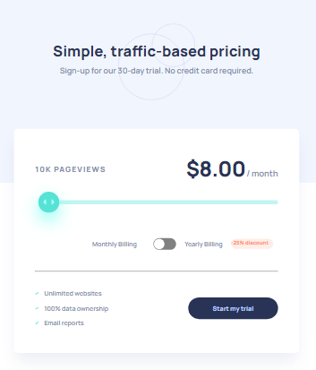

### Frontend Mentor - Interactive pricing component solution

This is a pricing component project that allows users to view pricing information based on their selected page view numbers. Users can interact with the slider and toggle to see prices for different page view numbers. The project also provides an optimal layout for the app depending on the user's device's screen size and includes hover states for all interactive elements on the page.

## Table of contents

- [Overview](Interactive card details form)
- [Built with](HTML, CSS, JS)
- [Author](Papuna Fshaveli)

### The challenge

Users should be able to:

- View the optimal layout for the app depending on their device's screen size
- See hover states for all interactive elements on the page
- Use the slider and toggle to see prices for different page view numbers

### Here are the steps to use the pricing component:

- Open the web page in your browser.
- Adjust the slider to select your desired page view number.
- Toggle the switch to switch between monthly and yearly pricing.
- The pricing information and page view numbers will update accordingly.

### Screenshot

### Built with

- Semantic HTML5 markup
- CSS custom properties
- Flexbox
- Mobile-first workflow
- DOM manipulations
- JS

## Author

- Github - [Papuna Fshaveli](https://github.com/papunafshaveli)
- Facebook - [@papunafshaveli](https://www.facebook.com/papunafshaveli)
